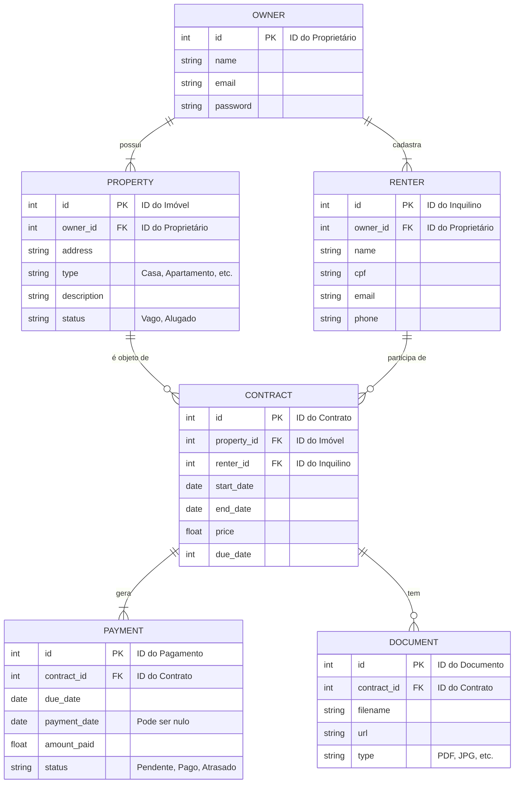

# Documento de Modelo de Dados (DER) - [NOME DO PROJETO]

### **Versão do Documento:** 1.0
### **Data:** 11 de outubro de 2025
### **Autor:** Gabriel Camelo

## 1. Introdução
Este documento fornece uma explicação detalhada do Diagrama de Entidade-Relacionamento (DER) para o sistema AlugaFácil. Ele descreve a arquitetura lógica do banco de dados, definindo as entidades principais, seus atributos e os relacionamentos entre elas.

Este modelo serve como um guia fundamental para a equipe de desenvolvimento, garantindo que a estrutura de dados implementada atenda a todos os requisitos funcionais previamente definidos.

## 2. Visão Geral do Diagrama
O diagrama abaixo ilustra as seis entidades centrais do sistema e como elas se interconectam para gerenciar as informações de proprietários, imóveis, inquilinos, contratos, pagamentos e documentos.

## 3. Descrição das Entidades e Atributos
A seguir, cada entidade e seus respectivos atributos são detalhados.

### 3.1. PROPRIETARIO
Representa o usuário principal do sistema, o dono dos imóveis.

|   Atributo        |	Tipo de Dado            |   Descrição                                                   |
|   :--             |   :--                     |   :--                                                         |
|   id (PK)         |   Identificador Único     |	Chave primária que identifica unicamente cada proprietário. |
|   name            |   Texto                   |   Nome completo do proprietário.                              |
|   email           |   Texto                   |   Endereço de e-mail, usado para login e comunicação.         |
|   password        |   Texto                   |   Senha do usuário, armazenada de forma criptografada (hash). |

### 3.2. PROPRIEDADE
Representa uma propriedade física (casa, apartamento) que pertence a um proprietário.

|   Atributo        |   Tipo de Dado            |   Descrição                                                   |
|   :--             |   :--                     |   :--                                                         |
|   id (PK)         |   Identificador Único     |   Chave primária que identifica unicamente cada imóvel.       |
|   owner_id (FK)   |   Chave Estrangeira       |   Referencia o id da tabela OWNER a quem o imóvel pertence.   |
|   address         |   Texto                   |   Endereço completo do imóvel.                                |
|   type            |   Texto                   |   Tipo do imóvel (Ex: "Casa", "Apartamento", "Kitnet").       |
|   description     |   Texto                   |   Campo para informações adicionais sobre o imóvel.           |
|   status          |   Texto                   |   Situação atual do imóvel (Ex: "Vago", "Alugado").           |

### 3.3. INQUILINO
Representa a pessoa física que aluga um dos imóveis.

|   Atributo        |   Tipo de Dado            |   Descrição                                                   |
|   :--             |   :--                     |   :--                                                         |
|   id (PK)         |   Identificador Único     |   Chave primária que identifica unicamente cada inquilino.    |
|   owner_id (FK)   |   Chave Estrangeira       |   Referencia o id da tabela OWNER que cadastrou o inquilino.  |
|   name            |   Texto                   |   Nome completo do inquilino.                                 |
|   cpf             |   Texto                   |   CPF do inquilino.                                           |
|   email           |   Texto                   |   E-mail de contato do inquilino.                             |
|   phone           |   Texto                   |   Telefone de contato do inquilino.                           |

### 3.4. CONTRATO
Entidade central que formaliza o aluguel, ligando um IMOVEL a um INQUILINO.

|   Atributo            |   Tipo de Dado            |   Descrição                                               |
|   :--                 |   :--                     |   :--                                                     |
|   id (PK)             |   Identificador Único     |   Chave primária que identifica unicamente cada contrato. |
|   property_id (FK)    |   Chave Estrangeira       |   Referencia o id do IMOVEL que está sendo alugado.       |
|   renter_id (FK)      |   Chave Estrangeira       |   Referencia o id do INQUILINO que está alugando.         |
|   start_date          |	Data                    |   Data de início da vigência do contrato.                 |
|   end_date            |   Data                    |   Data de término do contrato.                            |
|   price               |	Número Decimal          |   Valor monetário mensal do aluguel.                      |
|   due_date            |   Número Inteiro          |   Dia do mês para o vencimento do pagamento (1 a 31).     |

### 3.5. PAGAMENTO
Registra cada cobrança mensal (parcela) de um contrato de aluguel.

|   Atributo            |   Tipo de Dado            |   Descrição                                                               |
|   :--                 |   :--                     |   :--                                                                     |
|   id (PK)             |   Identificador Único     |   Chave primária que identifica unicamente cada registro de pagamento.    |
|   contract_id (FK)    |   Chave Estrangeira       |   Referencia o id do CONTRATO ao qual este pagamento pertence.            |
|   due_date            |   Data                    |   Data exata de vencimento desta parcela.                                 |
|   payment_date        |   Data                    |   Data em que o pagamento foi efetivado. Pode ser nulo se pendente.       |
|   amount_paid         |   Número Decimal          |   Valor efetivamente pago pelo inquilino.                                 |
|   status              |   Texto                   |   Situação da cobrança (Ex: "Pendente", "Pago", "Atrasado").              |

### 3.6. DOCUMENTO
Armazena referências a arquivos digitais associados a um contrato.

|   Atributo            |   Tipo de Dado            |   Descrição                                                           |
|   :--                 |   :--                     |   :--                                                                 |
|   id (PK)             |   Identificador Único     |   Chave primária que identifica unicamente cada documento.            |
|   contract_id (FK)    |   Chave Estrangeira       |   Referencia o id do CONTRATO ao qual o documento está vinculado.     |
|   filename            |   Texto                   |   Nome original do arquivo (Ex: "contrato_assinado.pdf").             |
|   url                 |   Texto                   |   Caminho/URL onde o arquivo está armazenado no servidor.             |
|   type                |   Texto                   |   Extensão ou tipo MIME do arquivo (Ex: "PDF", "JPG").                |

## 4. Descrição dos Relacionamentos

### PROPRIETARIO e IMOVEL (1 para N):

* Um PROPRIETARIO pode possuir um ou muitos IMOVEIS.

* Cada IMOVEL pertence a exatamente um PROPRIETARIO.

### PROPRIETARIO e INQUILINO (1 para N):

* Um PROPRIETARIO pode cadastrar e gerenciar um ou muitos INQUILINOS.

* Cada INQUILINO é gerenciado por exatamente um PROPRIETARIO.

### IMOVEL e CONTRATO (1 para N):

* Um IMOVEL pode ser objeto de zero ou muitos CONTRATOS (ao longo do tempo, mas apenas um ativo).

* Cada CONTRATO está associado a exatamente um IMOVEL.

### INQUILINO e CONTRATO (1 para N):

* Um INQUILINO pode participar de zero ou muitos CONTRATOS.

* Cada CONTRATO está associado a exatamente um INQUILINO.

### CONTRATO e PAGAMENTO (1 para N):

* Um CONTRATO gera um ou muitos PAGAMENTOS (as parcelas mensais).

* Cada PAGAMENTO pertence a exatamente um CONTRATO.

### CONTRATO e DOCUMENTO (1 para N):

* Um CONTRATO pode ter zero ou muitos DOCUMENTOS anexados.

* Cada DOCUMENTO está vinculado a exatamente um CONTRATO.